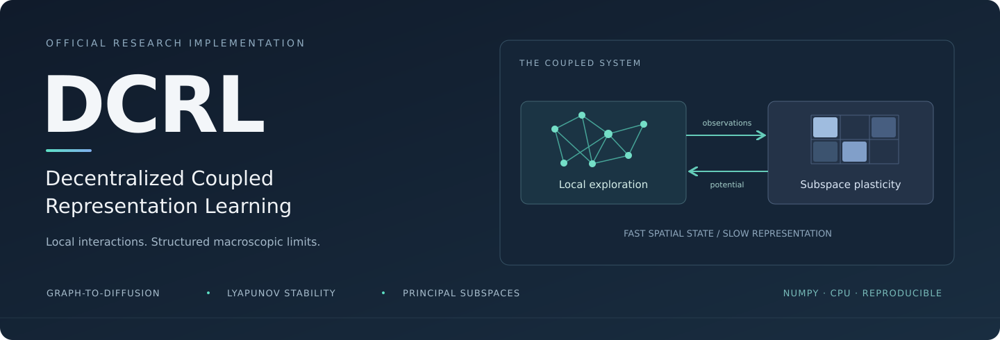
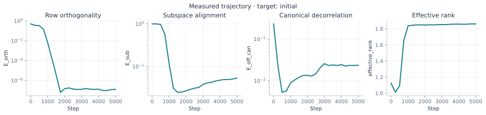

<p align="center">
  
</p>

<p align="center">
  <strong>Official research implementation</strong><br>
  Local exploration · Coupled slow–fast dynamics · Principal-subspace learning
</p>

<p align="center">
  <a href="#quick-start">Quick start</a> ·
  <a href="#experiments">Experiments</a> ·
  <a href="docs/METHOD.md">Method</a> ·
  <a href="docs/REPRODUCIBILITY.md">Reproducibility</a> ·
  <a href="docs/PAPER_MAPPING.md">Paper mapping</a> ·
  <a href="#citation">Citation</a> ·
  <a href="docs/README_zh.md">中文指南</a>
</p>

---

## Overview

**Decentralized Coupled Representation Learning (DCRL)** studies how local spatial exploration and subspace plasticity co-evolve. Fast Markovian observations drive a slow Oja-type update with matrix lateral inhibition. The numerical toolkit connects the paper's graph-to-diffusion, averaged stability, and principal-subspace results to inspectable experiments.

The repository provides synchronous **DCRL**, active-edge **A-DCRL**, analytic manifold geometry, graph-generator diagnostics, fixed-stream eigenspace references, mechanism ablations, and reproducible experiment records. The numerical core runs on CPU without pretrained models, network access, or an accelerator.

> **Reproduction scope.** The supplied supplementary implementation is preserved in [`legacy/`](legacy/). This release expands it into a tested research package. Synthetic runs and invariant diagnostics are executable end to end. Exact regeneration of the manuscript's large-scale tables requires the original feature matrices and complete run settings, which were not included in the supplied materials. Reconstructed settings are identified in the [paper-to-code mapping](docs/PAPER_MAPPING.md).

## Quick start

Use **Python 3.12** for the validated numerical environment. From the repository root:

```bash
python -m venv .venv
source .venv/bin/activate
python -m pip install -r requirements.txt
python -m pip install --no-deps -e .

python -m unittest discover -s tests -v
python -m dcrl run --config configs/quickstart.yaml
```

On Windows, activate with `.venv\Scripts\Activate.ps1` in PowerShell. The Python commands are identical.

The quick start generates a controlled HD-GMM substrate, evolves both the configuration and representation, and saves diagnostics to `results/quickstart/`. It uses matrix lateral inhibition, a step-size ratio of `0.005`, and **no QR stabilization**. A separate lightweight CI configuration is available at [`configs/smoke.yaml`](configs/smoke.yaml).

<p align="center">
  
</p>

<p align="center"><em>Actual release validation run. Trajectories use the initial eigenspace as reference; endpoint metrics are recomputed against the final configuration. These curves are not manuscript table values.</em></p>

## What is implemented

| Component | Implementation | Scientific role |
| :-- | :-- | :-- |
| Synchronous DCRL | [`dynamics.py`](src/dcrl/dynamics.py) | Algorithm 1; spatial update followed by finite-sample subspace Oja |
| Asynchronous A-DCRL | [`gossip.py`](src/dcrl/gossip.py) | Algorithm 2; one local spatial/Oja update and pairwise mixing |
| Manifold geometry | [`geometry.py`](src/dcrl/geometry.py) | Tangent projection and domain retraction |
| Graph generator | [`graph.py`](src/dcrl/graph.py) | Gibbs kernel versus analytic Langevin generator on the circle and sphere |
| Invariant metrics | [`metrics.py`](src/dcrl/metrics.py) | Orthogonality, principal angles, Procrustes-gauge decorrelation, effective rank |
| Fixed-stream references | [`baselines.py`](src/dcrl/baselines.py) | PCA, Oja, Sanger, EigenGame-type, distributed orthogonal iteration |
| Experiment execution | [`runner.py`](src/dcrl/runner.py) | Seeded runs, exact state resume, divergence records, multi-seed statistics |
| Original supplement | [`legacy/`](legacy/) | Supplied numerical routines, preserved with a source checksum manifest |

## Method in brief

For a configuration $X\in\mathbb{R}^{N\times n}$ and representation $W\in\mathbb{R}^{m\times n}$, let $Y=XW^\top$. With $W$ frozen during the spatial phase, the representation-induced potential is

$$U_W(x)=-\tfrac12\lVert Wx\rVert_2^2.$$

The implementation applies tangent-projected drift and noise, retracts each spatial state, and then updates the representation using the **new** observations:

$$\Delta W=\frac{1}{N}\left[Y^\top X-Y^\top YW\right],\qquad W^+=W+\eta_w\Delta W.$$

Training accumulates this update in blocks without constructing an $n\times n$ covariance matrix. Eigensolvers are used for independent evaluation and explicit baselines. The paper's frozen-potential/averaged guarantees and its coupled comparison dynamics are distinguished in [`docs/METHOD.md`](docs/METHOD.md).

## Experiments

All commands run from the repository root. Each experiment requires a new output directory; existing results are never silently overwritten.

| Experiment | Command |
| :-- | :-- |
| Coupled HD-GMM quick start | `python -m dcrl run --config configs/quickstart.yaml` |
| All synthetic substrates, three seeds | `python -m dcrl suite --config configs/synthetic_suite.yaml` |
| Matrix/scalar/no inhibition and operator ablations | `python -m dcrl suite --config configs/ablations.yaml` |
| Timescale sweep | `python -m dcrl suite --config configs/timescales.yaml` |
| Active-edge A-DCRL | `python -m dcrl run --config configs/adcrl.yaml` |
| Circle graph-to-diffusion diagnostic | `python -m dcrl graph --config configs/graph_circle.yaml` |
| Sphere graph-to-diffusion diagnostic | `python -m dcrl graph --config configs/graph_sphere.yaml` |
| Averaged Lyapunov flow and Euler remainder | `python -m dcrl lyapunov --output results/lyapunov` |
| Fixed-stream baseline calibration | `python -m dcrl baselines --config configs/baselines.yaml` |
| Measured runtime primitives | `python -m dcrl benchmark --output results/benchmark` |

A compact offline validation sequence is also provided:

```bash
bash scripts/reproduce.sh
```

The [`configs/paper_scale/`](configs/paper_scale/) configurations retain the manuscript's stated sample sizes, ambient dimensions, ranks, and 15,000-step spectral horizon where applicable. Other settings are explicit reconstruction choices. These runs can be much more expensive than the quick start.

### Pretrained features

The feature interface accepts a finite numeric matrix of shape `(N, n)` in `.npy` or `.npz` format. Checksums and preprocessing are recorded. Configurations cover the four feature families used in the paper:

| Feature family | Samples in manuscript | Ambient dimension | Main latent rank | Fixed-stream calibration rank |
| :-- | --: | --: | --: | --: |
| ResNet-18 / CIFAR-10 | 60,000 | 512 | 64 | 8 |
| ViT-B/16 / CIFAR-10 | 60,000 | 768 | 64 | 8 |
| VGG-16 / CIFAR-10 | 60,000 | 4,096 | 128 | 8 |
| BERT / AG News | 127,600 | 768 | 32 | 8 |

Set the feature path in the relevant configuration, then run:

```bash
python -m dcrl run --config configs/features/resnet18.yaml
python -m dcrl baselines --config configs/features/resnet18_baselines.yaml
```

[`docs/DATA.md`](docs/DATA.md) specifies the data contract and optional image/text feature-export recipes. Original checkpoints and pooling choices are required to recreate the original feature archive; generic pretrained weights do not establish that equivalence.

### Resume a run

```bash
python -m dcrl run --config configs/quickstart.yaml \
  --steps 8000 --resume results/quickstart/checkpoint.npz
```

`--steps` is the absolute target step, not an additional step count. Checkpoints include the configuration, spatial and representation states, RNG state, and diagnostic history. Changes to algorithm parameters, data specification, seed, or target protocol are rejected on resume.

## Reading the results

| Artifact | Contents |
| :-- | :-- |
| `config.json` | Resolved run settings; portable paths |
| `metadata.json` | Input hashes, preprocessing, numerical environment, target protocol, source fingerprint |
| `history.csv` | Raw measured diagnostics at logged steps |
| `summary.json` | Endpoint metrics, eigensolver residual, eigengap, completion status |
| `checkpoint.npz` | Pickle-free state for exact resume in the same numerical environment |
| `final.npz` | Final configuration, representation, and evaluation eigenbasis |
| `invariants.svg`, `spectrum.svg` | Figures generated from the saved measurements |
| `aggregate.csv` | Suite means and sample standard deviations, with completion/divergence counts |

The covariance convention is the **uncentered second moment** $X^\top X/N$ after any explicitly configured initial preprocessing. No implicit recentering occurs during evaluation. The canonical gauge is obtained from `SVD(W @ Q_target)`; it is not chosen by diagonalizing the measured latent covariance. Undefined quantities are exported as `null` or empty CSV fields. Full definitions are in [`docs/METHOD.md`](docs/METHOD.md).

## Reproducibility and validation

The repository includes scientific regression tests for update identities, manifold constraints, the Lyapunov derivative, graph generators, rank-collapse handling, gossip conservation, and exact checkpoint continuation. GitHub Actions runs the numerical tests and an offline smoke experiment. The [validation record](docs/VALIDATION.md) reports what was actually executed for this release, including the feature extraction and large-scale runs that were not executed.

The A-DCRL simulator stores all local copies in one process. Its per-agent state and active-edge primitive expose the communication model; it is not a multi-machine runtime. As in the paper, no separate asynchronous convergence theorem is asserted.

## Citation

Bibliographic metadata is reserved for the publication release. The repository contains no paper-author names, affiliations, email addresses, or author-linked repository URLs.

```bibtex
@inproceedings{xxx,
  title     = {xxx},
  author    = {xxx},
  booktitle = {xxx},
  year      = {xxx},
  url       = {xxx}
}
```

See [`CITATION.bib`](CITATION.bib). Code is available under the [MIT License](LICENSE). External datasets and pretrained weights retain their own licenses.
